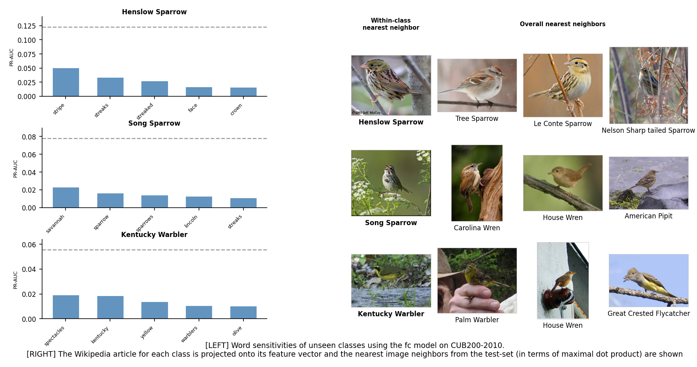
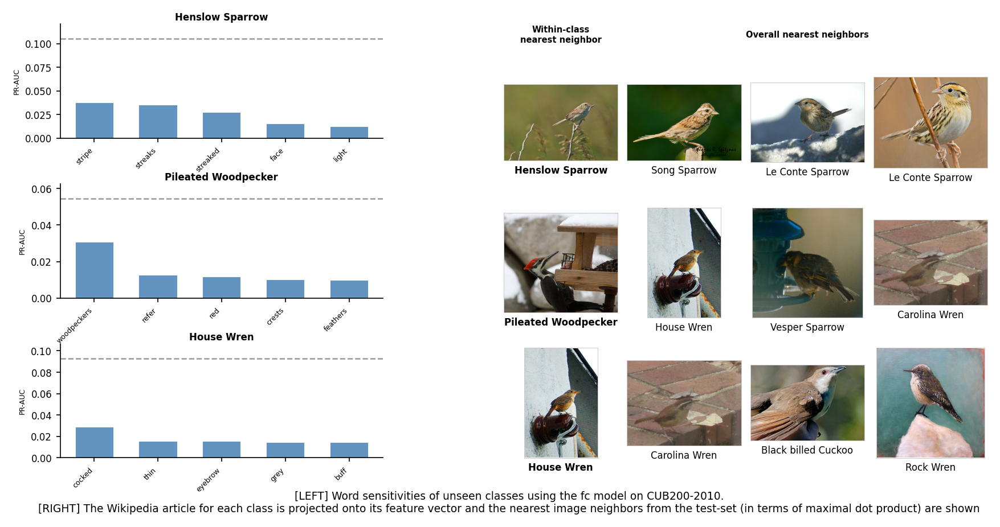
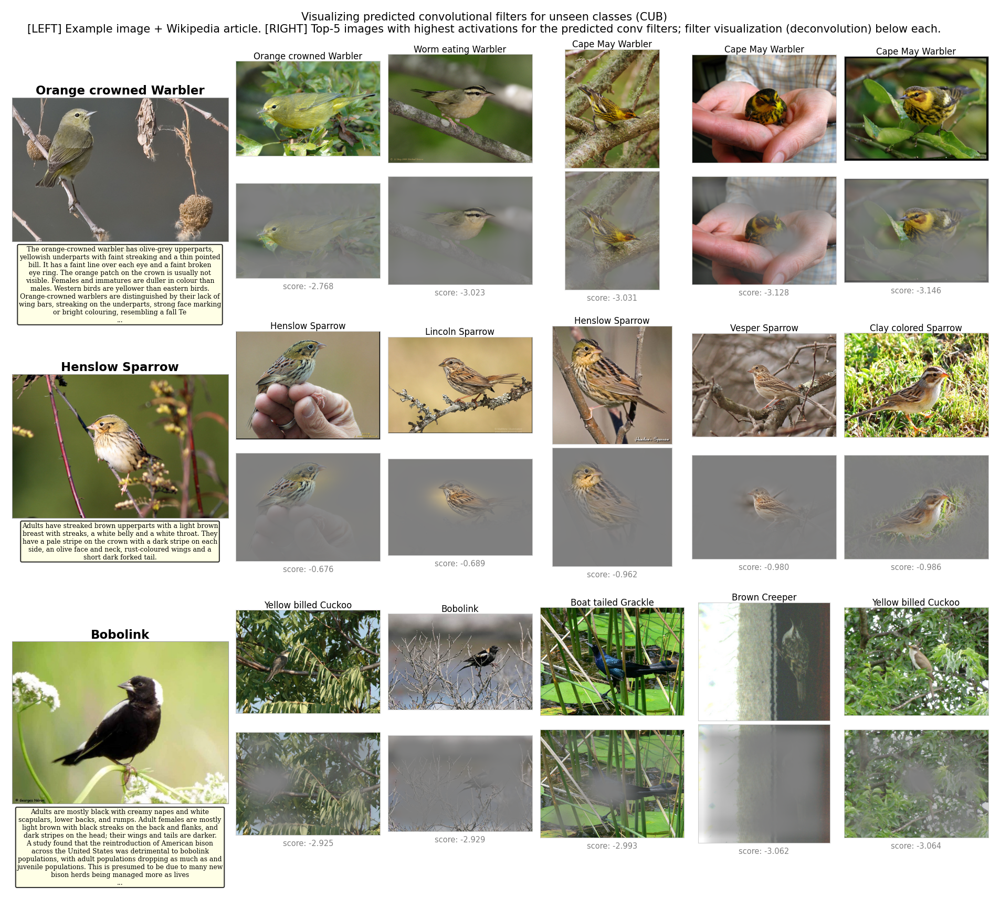
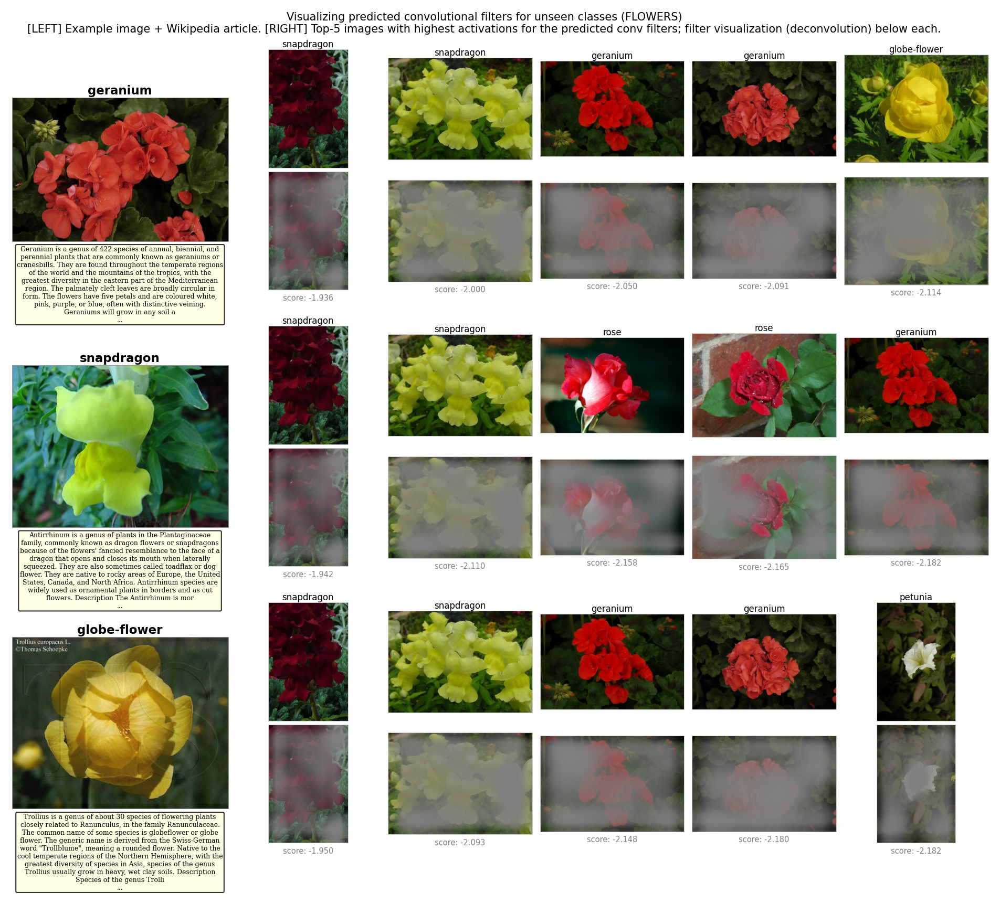

# Predicting Deep Zero-Shot CNNs from Text — Unofficial Reproduction

A from-scratch PyTorch reproduction of Ba et al.'s ICCV 2015 zero-shot CNN approach, which predicts visual classifiers from textual class descriptions.

> **NOTE:** This repository is implemented from scratch as a course project for CIML (Computational Intelligence and Machine Learning) since there is no official or public implementation of the paper available.

## Paper Details

- **Title:** Predicting deep zero-shot convolutional neural networks using textual descriptions [[PDF](https://openaccess.thecvf.com/content_iccv_2015/papers/Ba_Predicting_Deep_Zero-Shot_ICCV_2015_paper.pdf)]
- **Authors:** Jimmy Lei Ba, Kevin Swersky, Sanja Fidler, Ruslan Salakhutdinov (University of Toronto)
- **Venue:** ICCV 2015
- **Summary:** Uses textual descriptions (e.g. Wikipedia articles) to predict the weights of both convolutional and fully connected layers in a deep CNN for zero-shot visual classification, without hand-defined semantic attributes. The key idea is: given a text description $t_c$ for class $c$, a neural network $f_t(t_c)$ predicts classifier weights $w_c$, and the classification score is $\hat{y}_c = w_c^\top g_v(x)$ where $g_v$ maps images to a joint embedding space (Sec 3.2). This extends to predicting convolutional filters (Sec 3.3) and a joint fc+conv model (Sec 3.4).

<table width="100%"><tr><td align="left"><a href="https://huggingface.co/LiXiuyin/zero-shot-cnn-comp7404-group17/tree/main"></a></td><td align="center"><a href="https://github.com/LiXiuyin/zero-shot-cnn-comp7404-group17"></a></td><td align="right"><a href="https://drive.google.com/file/d/1ki7MEb_LcPpqWF3HNN9S1UJ9hYzpr5mz/view"></a></td></tr></table>

## Setup

### Option 1: Using uv (recommended)

```bash
curl -LsSf https://astral.sh/uv/install.sh | sh   # install uv
uv sync && source .venv/bin/activate                # install deps + activate
```

### Option 2: pip + venv

```bash
python -m venv .venv && source .venv/bin/activate
pip install -r requirements.txt
```

### Option 3: Conda

```bash
conda create -n ciml python=3.14 && conda activate ciml
pip install -r requirements.txt
```

> **Note:** Requires Python >= 3.10 (see `pyproject.toml`). Keep the version consistent with `.python-version`.

## Quick Start

The entire workflow is driven by **three scripts**. Each script automatically sets up the environment and downloads datasets if needed.

### 1. Train all paper models — `train.sh`

```bash
bash train.sh                  # single-run mode (default: --n-folds 1)
bash train.sh --n-folds 5      # 5-fold cross-validation (paper default)
```

This will:
1. Sync the `uv` environment and activate it
2. Download the datasets if not already present
3. Train all models needed to reproduce the paper results:
   - **Table 1:** fc, conv, fc+conv models with BCE loss on both CUB and Flowers; additionally trains hinge and euclidean variants for all model types (except conv+euclidean, which is unsupported) for the "best among loss functions" comparison
   - **Table 2:** Reuses the fc models from Table 1 (BCE, Hinge, Euclidean on CUB)
   - **Table 3:** FC+Conv models with conv4_3 and pool5 layers on CUB (conv5_3 reuses Table 1)
   - **Table 4:** FC and FC+Conv models on the full dataset (no unseen classes) with a 50/50 split for both CUB and Flowers
4. Optionally upload checkpoints to HuggingFace

**CLI options:**
- `--upload-hf` — Auto-upload checkpoints to HuggingFace (skip interactive prompt)
- `--epochs N` — Override max epochs (default: 200)
- `--n-folds N` — Override CV folds (default: 1; paper uses 5)

> **Notes:**
> - With `--n-folds 5`, checkpoints are saved in `checkpoints/fold{i}/`; with `--n-folds 1`, checkpoints are saved in `checkpoints/` directly.
> - Logs are saved in `logs/`.
> - For Tables 2, 3, and Figure 2, we report results on CUB-200-2011 (the paper uses CUB-200-2010, which is not publicly available).

### 2. Reproduce results — `reproduce.sh`

```bash
bash reproduce.sh      # downloads checkpoints from HuggingFace if not trained locally
```

This will:
1. Check for LaTeX (XeLaTeX); optionally install with `--install-latex`
2. Download pre-trained checkpoints from HuggingFace (if you haven't trained locally)
3. Sync the `uv` environment and download datasets if needed
4. Run evaluation scripts (`table1.py` – `table4.py`, `figure2.py`, `figure5.py`) with auto-detected checkpoints
5. Compile all tables to LaTeX and generate a combined PDF

| Output | Location |
|--------|----------|
| CSV tables | `results/tables/Table*.csv` |
| LaTeX tables | `results/tex/Table*.tex` |
| Compiled PDF | `results/AllTables.pdf` |
| Figures | `results/figures/Figure*.png` |

### 3. Run innovation experiments — `innovate.sh`

```bash
bash innovate.sh       # extensions beyond the paper
```

This will:
1. Sync the `uv` environment and download datasets if needed
2. Train 13 innovation experiments on CUB-200-2011:

| Section | Variable | Experiments |
|---------|----------|-------------|
| **A. Loss** | Auxiliary loss on top of BCE | A1: CLIP contrastive, A2: Center alignment, A3: Embedding MSE |
| **B. Text encoder** | Replace TF-IDF | B1: SBERT (384-d), B2: SBERT-multi (384-d), B3: CLIP text (512-d), B4: CLIP-multi (512-d) |
| **C. Image backbone** | Replace VGG-19 | C1: DenseNet-121 fc+conv (default), C2: ResNet-50 fc+conv (default), C3: DenseNet-121 fc+conv (penultimate), C4: ResNet-50 fc+conv (penultimate), C5: DenseNet-121 fc-only (penultimate), C6: ResNet-50 fc-only (penultimate) |

3. Evaluate each checkpoint and generate the innovation summary table
4. Optionally upload innovation checkpoints to HuggingFace

All innovation checkpoints are saved under `checkpoints/innov/`.

> For training arguments, checkpoint naming, manual per-table commands, and other details, see **[`docs/REPRODUCTION_GUIDE.md`](docs/REPRODUCTION_GUIDE.md)**.

---

## Reproduced Results

> **Note:** Our results differ from the paper because: (1) Tables 2, 3, Fig 2 use CUB-200-2011 instead of CUB-200-2010 (no longer available; ~2× more images); (2) Tables 2–4 use single runs instead of 5-fold CV; (3) conv/fc+conv use lr=5e-4 (paper uses 1e-4). See [Known Deviations](docs/REPRODUCTION_GUIDE.md#known-deviations-from-paper) for details.

### Table 1 — ROC-AUC and PR-AUC comparison (Paper Sec. 5.4)

> Paper: "For both ROC-AUC and PR-AUC, we report the best numbers obtained among the models trained on different objective functions."

| Dataset | Model | ROC-AUC unseen (Paper / Ours) | ROC-AUC seen | ROC-AUC mean | PR-AUC unseen | PR-AUC seen | PR-AUC mean |
|---|---|---|---|---|---|---|---|
| CUB-200-2011 | fc | 0.82 / **0.712** | 0.974 / **0.981** | 0.943 / **0.927** | 0.11 / **0.066** | 0.33 / **0.492** | 0.286 / **0.407** |
| CUB-200-2011 | conv | 0.80 / **0.702** | 0.96 / **0.917** | 0.925 / **0.874** | 0.085 / **0.074** | 0.15 / **0.116** | 0.14 / **0.107** |
| CUB-200-2011 | fc+conv | 0.85 / **0.680** | 0.98 / **0.983** | 0.953 / **0.923** | 0.13 / **0.064** | 0.37 / **0.554** | 0.31 / **0.456** |
| Oxford Flower | fc | 0.70 / **0.589** | 0.987 / **0.953** | 0.90 / **0.881** | 0.07 / **0.135** | 0.65 / **0.402** | 0.52 / **0.349** |
| Oxford Flower | conv | 0.65 / **0.581** | 0.97 / **0.841** | 0.85 / **0.790** | 0.054 / **0.088** | 0.61 / **0.116** | 0.46 / **0.111** |
| Oxford Flower | fc+conv | 0.71 / **0.588** | 0.989 / **0.953** | 0.93 / **0.881** | 0.067 / **0.095** | 0.69 / **0.395** | 0.56 / **0.336** |

### Table 2 — Loss function comparison, fc model (Paper Sec. 5.5)

> Paper reports on CUB-200-2010; ours on CUB-200-2011.

| Metric | BCE (Paper / Ours) | Hinge (Paper / Ours) | Euclidean (Paper / Ours) |
|---|---|---|---|
| unseen ROC-AUC | 0.82 / **0.712** | 0.795 / **0.681** | 0.70 / **0.745** |
| seen ROC-AUC | 0.973 / **0.981** | 0.97 / **0.982** | 0.95 / **0.950** |
| mean ROC-AUC | 0.937 / **0.927** | 0.934 / **0.922** | 0.90 / **0.909** |
| unseen PR-AUC | 0.103 / **0.066** | 0.10 / **0.066** | 0.076 / **0.156** |
| seen PR-AUC | 0.33 / **0.492** | 0.41 / **0.586** | 0.37 / **0.252** |
| mean PR-AUC | 0.287 / **0.407** | 0.35 / **0.482** | 0.31 / **0.233** |
| unseen class acc. | 0.01 / **0.112** | 0.006 / **0.052** | 0.12 / **0.162** |
| seen class acc. | 0.35 / **0.496** | 0.43 / **0.585** | 0.263 / **0.299** |
| mean class acc. | 0.17 / **0.419** | 0.205 / **0.479** | 0.19 / **0.272** |
| unseen top-5 acc. | 0.176 / **0.409** | 0.182 / **0.275** | 0.428 / **0.404** |
| seen top-5 acc. | 0.58 / **0.826** | 0.668 / **0.861** | 0.45 / **0.665** |
| mean top-5 acc. | 0.38 / **0.742** | 0.41 / **0.744** | 0.44 / **0.613** |

### Table 3 — Conv feature layer ablation, fc+conv (Paper Sec. 5.6)

> Paper reports on CUB-200-2010; ours on CUB-200-2011.

| Metric | Conv5_3 (Paper / Ours) | Conv4_3 (Paper / Ours) | Pool5 (Paper / Ours) |
|---|---|---|---|
| mean ROC-AUC | 0.91 / **0.923** | 0.6 / **0.916** | 0.82 / **0.926** |
| mean PR-AUC | 0.28 / **0.456** | 0.09 / **0.449** | 0.173 / **0.465** |
| mean top-5 acc. | 0.25 / **0.788** | 0.153 / **0.760** | 0.02 / **0.774** |

### Table 4 — Full-dataset supervised baseline, 50/50 split, top-1 acc. (Paper Sec. 5.7)

> Paper also includes CUB-2010 (fc: 0.60, fc+conv: 0.62), which we cannot reproduce.

| Model | CUB-2011 (Paper / Ours) | Oxford Flowers (Paper / Ours) |
|---|---|---|
| fc | 0.64 / **0.484** | 0.73 / **0.684** |
| fc+conv | 0.66 / **0.495** | 0.77 / **0.744** |

---

## Our Improvements (beyond the paper)

### A. Loss Function Ablations

Auxiliary loss terms combined with BCE: $L = L_{BCE} + \lambda L_{aux}$

1. **CLIP Contrastive Loss** (`--use_clip_loss`, λ=0.1, τ=0.07) — Symmetric InfoNCE-style contrastive loss encouraging matched image-text pairs to be close and mismatched pairs to be far apart:

$$L_{CLIP} = \frac{1}{2} (L_{i2t} + L_{t2i}) \times B$$

where $L_{i2t}$ is cross-entropy over image-to-text similarities and $L_{t2i}$ is text-to-image.

2. **Center Alignment Loss** (`--use_center_align`, λ=0.1) — aligns the global centers of visual and textual embeddings:

$$L_{center} = \| \text{mean}(f) - \text{mean}(g) \|^2_2$$

3. **Embedding MSE Loss** (`--use_embedding_loss`, λ=1.0) — directly minimizes MSE between image and text embeddings with sum reduction: $L_{emb} = \sum \|g - f\|^2$

**Ablation of loss functions on CUB-200-2011** (fc+conv, VGG-19, TF-IDF)
> Bold in this table means **higher is better**; ties are bolded together.

| Setting | Seen PR-AUC | Seen ROC-AUC | Unseen PR-AUC | Unseen ROC-AUC |
|---|---:|---:|---:|---:|
| A0: BCE (baseline) | 0.554 | **0.983** | 0.064 | 0.680 |
| A1: CLIP-loss (λ=0.1, τ=0.07) | **0.557** | **0.983** | **0.072** | **0.692** |
| A2: CenterAlign (λ=0.1) | 0.517 | 0.982 | 0.069 | 0.703 |
| A3: EmbeddingMSE (λ=1.0) | 0.167 | 0.937 | 0.067 | 0.699 |

### B. Text Encoder Ablations

Replace TF-IDF with modern pretrained text encoders:

| Encoder | Model | Dimension | Pooling Strategy | Text input |
|---------|-------|----------|------------------|------------|
| TF-IDF (baseline) | sklearn TfidfVectorizer | 9763-d | Token-level TF-IDF with log normalization | Wikipedia articles |
| B1: SBERT | sentence-transformers/all-MiniLM-L6-v2 | 384-d | Document-level encoding | Wikipedia articles |
| B2: SBERT-multi | sentence-transformers/all-MiniLM-L6-v2 | 384-d | Sentence-level mean pooling | Wikipedia articles |
| B3: CLIP-text | OpenAI CLIP ViT-B/32 | 512-d | Document-level EOS token pooling | Wikipedia articles |
| B4: CLIP-multi | OpenAI CLIP ViT-B/32 | 512-d | Sentence-level mean pooling | Wikipedia articles |

**Ablation of text encoders (CUB-200-2011)** (fc+conv, VGG-19, BCE)
> Bold in this table means **higher is better**; ties are bolded together.

| Text encoder | Seen PR-AUC | Seen ROC-AUC | Unseen PR-AUC | Unseen ROC-AUC |
|---|---:|---:|---:|---:|
| TF-IDF (baseline) | 0.554 | **0.983** | 0.064 | 0.680 |
| B1: SBERT | 0.518 | 0.979 | **0.153** | **0.821** |
| B2: SBERT-multi | 0.473 | 0.976 | 0.126 | 0.799 |
| B3: CLIP-text | 0.514 | **0.983** | 0.283 | 0.862 |
| B4: CLIP-multi | 0.454 | 0.977 | 0.244 | **0.886** |

### C. Image Backbone Ablations

Replace VGG-19 with modern CNN backbones. All backbones support both conv and fc branches:

| Backbone | Conv branch | FC mode: default | FC mode: penultimate |
|----------|-------------|------------------|---------------------|
| VGG-19 (baseline) | conv5_3 | fc2 (4096-d) | N/A |
| C1/C3/C5: DenseNet-121 | denseblock3 | classifier (1000-d) | avgpool (1024-d) |
| C2/C4/C6: ResNet-50 | layer3 | fc (1000-d) | avgpool (2048-d) |

**FC modes:**
- **default** — Pass through the pretrained classifier head
- **penultimate** — Skip classifier, use avgpool features directly

**Model types:** C1-C4 use fc+conv (both branches); C5-C6 use fc-only (conv branch disabled)

**Ablation of image backbones (CUB-200-2011)** (TF-IDF, BCE)
> Bold in this table means **higher is better**; ties are bolded together.

| Backbone | Model type | FC mode | Seen PR-AUC | Seen ROC-AUC | Unseen PR-AUC | Unseen ROC-AUC |
|---|---|---|---:|---:|---:|---:|
| VGG-19 (baseline) | fc+conv | default | 0.554 | 0.983 | 0.064 | 0.680 |
| C1: DenseNet-121 | fc+conv | default | **0.584** | **0.986** | **0.094** | **0.771** |
| C2: ResNet-50 | fc+conv | default | 0.517 | 0.981 | 0.069 | 0.695 |
| C3: DenseNet-121 | fc+conv | penultimate | 0.513 | 0.983 | 0.083 | 0.748 |
| C4: ResNet-50 | fc+conv | penultimate | 0.262 | 0.964 | 0.089 | 0.740 |
| C5: DenseNet-121 | fc-only | penultimate | 0.551 | 0.985 | 0.080 | 0.744 |
| C6: ResNet-50 | fc-only | penultimate | 0.045 | 0.846 | 0.047 | 0.617 |

> For detailed specifications of text encoder pooling mechanisms (exact split patterns, truncation lengths) and image backbone architectures (layer sources, spatial dimensions), see **[`docs/REPRODUCTION_GUIDE.md#extension-components`](docs/REPRODUCTION_GUIDE.md#extension-components)**.

---

## Visualizations

### Figure 2 — Word Sensitivity and Nearest Neighbor Retrieval

Generated from the fc model on CUB-200-2011 using conv5_3 features.

**Left panel (Figure2_1.png):** Word sensitivity analysis for unseen classes. For each class, we ablate individual words from its TF-IDF description and measure the drop in PR-AUC. The bar charts show the top 5 words whose removal causes the largest PR-AUC drop, with gray dashed lines indicating baseline PR-AUC. This demonstrates which descriptive words are most critical for zero-shot recognition.

**Right panel (Figure2_2.png):** Nearest neighbor retrieval using text-encoded features. For each unseen class, we project its Wikipedia article to the text embedding space and retrieve: (1) the within-class nearest neighbor (leftmost column) and (2) the top 3 overall nearest neighbors from all test images. This demonstrates that the learned semantic embedding space groups visually similar classes together.




### Figure 5 — Convolutional Filter Visualization (Appendix)

Visualization of predicted convolutional filters for unseen classes. The conv branch predicts K'=5 filters of size 3×3 from the 300-d text hidden layer (Sec 3.3).

**Each row shows one unseen class:**
- **Left:** Example image from the class + Wikipedia article excerpt (used as text input)
- **Right columns:** Top-5 images with highest activation for the predicted conv filter (from test set, both seen and unseen classes)
- **Bottom row:** Deconvolution visualization showing which image regions activate the filter most (Zeiler-Fergus style heatmap overlay)

This demonstrates that the text-predicted convolutional filters learn class-specific visual patterns without ever seeing images from the unseen classes during training.




---

## Directory Structure

```
├── train.sh             # Train all paper models
├── reproduce.sh         # Generate all tables and figures from checkpoints
├── innovate.sh          # Run innovation experiments (loss, text, backbone ablation)
├── main.py              # Entry point: train / eval / sanity check
├── pyproject.toml       # Project metadata and dependencies (for uv/pip)
├── requirements.txt     # requirements-style export (generated via `uv export`)
├── data/
│   ├── dataset.py       # ZeroShotDataset with train/test_seen/test_unseen splits
│   ├── download_dataset.py  # Download images from Google Drive
│   ├── preparation.py   # Data split helpers: prepare_birds/flowers_zero_shot, prepare_*_50_50
│   ├── image_preprocessor.py # Image transforms (center crop 224×224)
│   ├── sampler.py       # ClassAwareSampler for balanced batches
│   ├── strip_class_names.py  # Utility for cleaning class name prefixes
│   ├── text_processor.py  # TF-IDF text features (9763-d)
│   ├── text_sbert.py    # SBERT text encoder (all-MiniLM-L6-v2, 384-d)
│   ├── text_sbert_multi.py  # SBERT multi-granularity encoder (sentence-level pooling, 384-d)
│   ├── text_clip.py     # CLIP text encoder (ViT-B/32, 512-d)
│   ├── text_clip_multi.py   # CLIP multi-granularity encoder (sentence-level pooling, 512-d)
│   └── wikipedia/       # Wikipedia JSONL texts (birds.jsonl, flowers.jsonl)
├── models/
│   ├── zero_shot_model.py   # ZeroShotModel: fc / conv / fc+conv (Sec 3.2–3.4)
│   ├── text_encoder.py      # Text encoder ft(·): p → 300 → k
│   ├── image_encoder.py     # Image encoder gv(·): VGG19/DenseNet121/ResNet50 → k
│   └── weight_predictor.py  # ConvWeightPredictor: 300 → K'×3×3 filters
├── scripts/
│   ├── train.py         # Main training loop with early stopping + CV
│   ├── evaluate.py      # ROC-AUC, PR-AUC, Top-1/Top-5 evaluation
│   └── reproduce/       # Table/figure generation scripts
│       ├── table1.py – table4.py   # Paper table reproduction
│       ├── table_innov.py          # Innovation summary table
│       ├── figure2.py              # Word sensitivity + NN retrieval
│       ├── figure5.py              # Conv filter visualization (Appendix)
│       ├── compile_all_tables.py   # LaTeX compilation
│       ├── common.py               # Shared helpers (checkpoint auto-detection, output dirs)
│       └── eval_utils.py           # Evaluation utilities (inference, metrics, CV fold loading)
├── utils/
│   ├── config.py        # Default hyperparameters (paper + extensions)
│   ├── losses.py        # BCE, Hinge, Euclidean, CLIP, alignment losses
│   ├── seed_utils.py    # Seed management for reproducibility
│   └── filename_utils.py  # Auto-generate checkpoint/log filenames
├── results/             # Generated CSV tables, LaTeX files, figures
├── checkpoints/         # Model checkpoints (auto-generated, gitignored)
├── logs/                # Training CSV logs (auto-generated)
```

## Implementation Details

This implementation strictly follows Ba et al. ICCV 2015:

- **Architecture**: Three model types — fc (Sec 3.2), conv (Sec 3.3), and fc+conv (Sec 3.4)
- **Text encoder ft(·)**: p → 300 → k with small initialization (std=0.01)
- **Image encoder gv(·)**: VGG fc2 (4096-d) → 300 → k with frozen pretrained weights
- **Conv weight predictor**: 300 → K'×3×3 filters (K'=5)
- **Loss functions**: BCE, Hinge, Euclidean (with extension auxiliary losses)
- **Optimization**: Adam with lr=1e-4 (fc) or lr=5e-4 (conv/fc+conv)
- **Data splits**: 40/160 (CUB), 20/82 (Flowers), 80/20 train/test within seen
- **Evaluation**: 5-fold cross-validation (single run in `train.sh`)

> For complete implementation specifications including exact layer dimensions, initialization values, and code snippets, see **[`docs/REPRODUCTION_GUIDE.md#implementation-details`](docs/REPRODUCTION_GUIDE.md#implementation-details)**.

### Extended Components (beyond paper)

**Text encoders**: SBERT (384-d), CLIP (512-d) with document-level and sentence-level pooling variants.

**Image backbones**: DenseNet-121, ResNet-50 with support for both conv and fc branches. Two FC modes: `default` (through classifier) and `penultimate` (skip classifier).

> For detailed specifications of extension components including exact pooling mechanisms and architecture diagrams, see **[`docs/REPRODUCTION_GUIDE.md#extension-components`](docs/REPRODUCTION_GUIDE.md#extension-components)**.

---

## Citation

```bibtex
@inproceedings{ba2015predicting,
  title={Predicting deep zero-shot convolutional neural networks using textual descriptions},
  author={Ba, Jimmy Lei and Swersky, Kevin and Fidler, Sanja and Salakhutdinov, Ruslan},
  booktitle={ICCV},
  year={2015}
}
```

## Disclaimer

This is an unofficial, educational reproduction and is not affiliated with the paper authors or their institutions.
