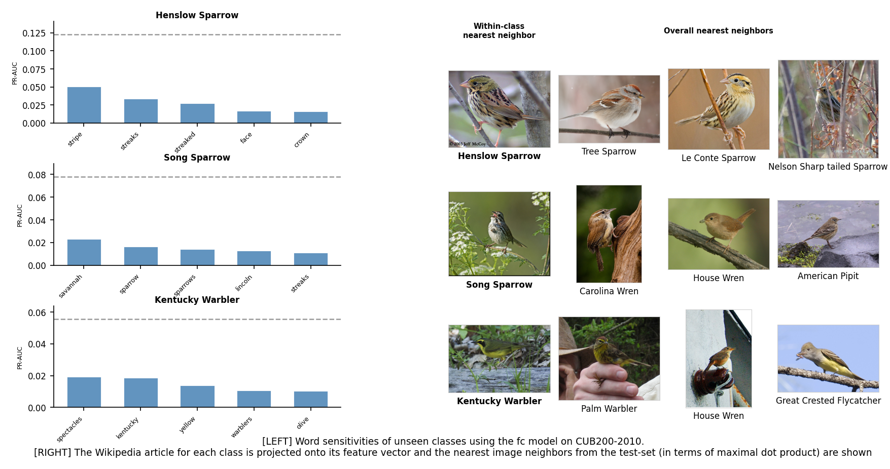
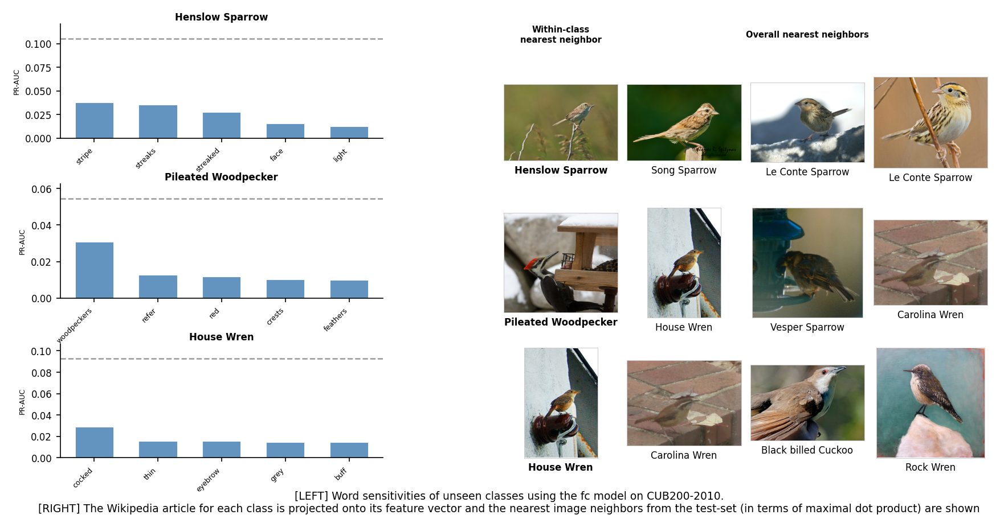
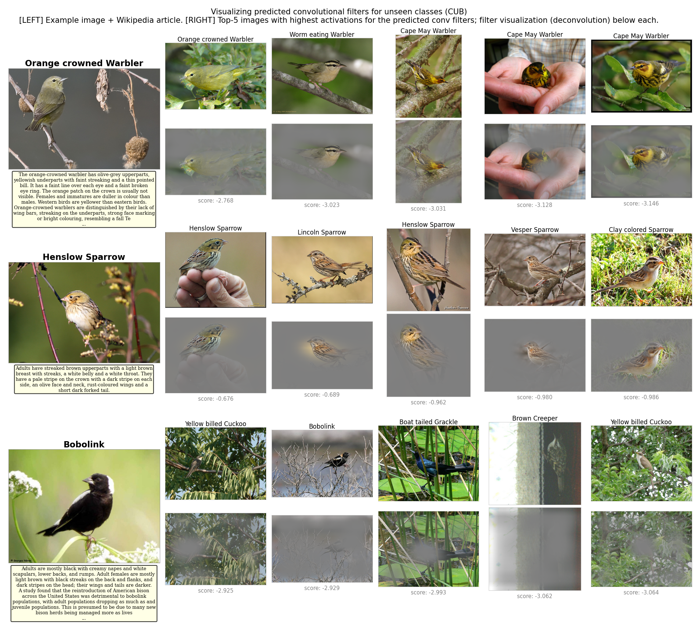
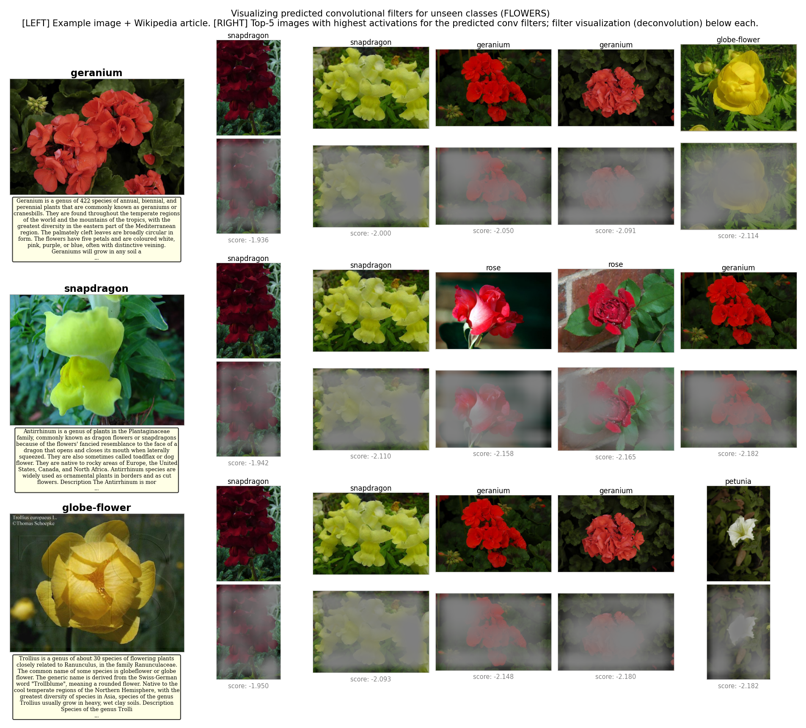

# 从文本预测零样本 CNN：非官方复现与扩展

**简体中文** | [English](README.en.md)

这是对 Ba 等人 ICCV 2015 论文《Predicting Deep Zero-Shot Convolutional Neural Networks Using Textual Descriptions》的 PyTorch 从零复现。模型根据类别文本描述预测视觉分类器参数，从而在训练阶段未见过目标类别图像的条件下进行零样本识别。

> 本项目是香港大学 CIML（Computational Intelligence and Machine Learning）课程项目。由于论文没有公开官方实现，仓库中的训练、评测与扩展代码均由项目组重新实现。

## 论文与方法

- 论文：[PDF](https://openaccess.thecvf.com/content_iccv_2015/papers/Ba_Predicting_Deep_Zero-Shot_ICCV_2015_paper.pdf)
- 作者：Jimmy Lei Ba、Kevin Swersky、Sanja Fidler、Ruslan Salakhutdinov
- 会议：ICCV 2015

给定类别 `c` 的文本描述 `t_c`，文本网络 `f_t(t_c)` 预测分类器权重 `w_c`；图像编码器 `g_v(x)` 将图像映射到联合嵌入空间，分类分数为：

```math
\hat{y}_c = w_c^\top g_v(x)
```

实现覆盖论文中的全连接层权重预测、卷积滤波器预测和 `fc+conv` 联合模型，并在 CUB-200-2011 与 Oxford Flowers 上复现与扩展实验。

<table width="100%"><tr><td align="left"><a href="https://huggingface.co/LiXiuyin/zero-shot-cnn-comp7404-group17/tree/main"></a></td><td align="center"><a href="https://github.com/LiXiuyin/zero-shot-cnn-comp7404-group17"></a></td><td align="right"><a href="https://drive.google.com/file/d/1ki7MEb_LcPpqWF3HNN9S1UJ9hYzpr5mz/view"></a></td></tr></table>

## 环境安装

### 使用 uv（推荐）

```bash
curl -LsSf https://astral.sh/uv/install.sh | sh
uv sync
source .venv/bin/activate
```

### 使用 pip 或 Conda

```bash
python -m venv .venv
source .venv/bin/activate
pip install -r requirements.txt

# 或
conda create -n ciml python=3.14
conda activate ciml
pip install -r requirements.txt
```

项目要求 Python 3.10 及以上，具体版本以 `pyproject.toml` 和 `.python-version` 为准。

## 三条主流程

### 1. 训练论文模型

```bash
bash train.sh
bash train.sh --n-folds 5
```

脚本会安装依赖、按需下载数据，并训练论文表 1–4 和图 2/5 所需的 `fc`、`conv`、`fc+conv` 模型及 BCE、Hinge、Euclidean 损失变体。`--n-folds 5` 使用论文默认的五折交叉验证；默认单次运行用于快速复现。

### 2. 复现实验结果

```bash
bash reproduce.sh
```

若本地没有 checkpoint，脚本会从 Hugging Face 下载；随后运行表格与图像生成脚本，并输出：

| 结果 | 路径 |
|---|---|
| CSV 表格 | `results/tables/Table*.csv` |
| LaTeX 表格 | `results/tex/Table*.tex` |
| 汇总 PDF | `results/AllTables.pdf` |
| 可视化 | `results/figures/Figure*.png` |

### 3. 运行扩展实验

```bash
bash innovate.sh
```

扩展实验在 CUB-200-2011 上覆盖三类变量：

- **损失函数**：CLIP 对比损失、中心对齐损失、嵌入 MSE；
- **文本编码器**：SBERT、SBERT 多粒度、CLIP 文本编码器及其多粒度版本；
- **图像主干**：DenseNet-121、ResNet-50，不同特征层及 `fc` / `fc+conv` 组合。

完整参数、checkpoint 命名和单项运行方法见[复现指南](docs/REPRODUCTION_GUIDE.md)。

## 主要复现结果

由于 CUB-200-2010 已不可公开获取，部分实验使用 CUB-200-2011；部分表格采用单次运行而非五折交叉验证，卷积分支学习率也与论文设置不同。因此，项目明确区分论文数字与本仓库结果，具体偏差见[已知差异](docs/REPRODUCTION_GUIDE.md#known-deviations-from-paper)。

部分结果如下：

| 数据集 / 模型 | 未见类 ROC-AUC | 已见类 ROC-AUC | 平均 ROC-AUC | 未见类 PR-AUC | 已见类 PR-AUC |
|---|---:|---:|---:|---:|---:|
| CUB-200-2011 / `fc` | 0.712 | 0.981 | 0.927 | 0.066 | 0.492 |
| CUB-200-2011 / `conv` | 0.702 | 0.917 | 0.874 | 0.074 | 0.116 |
| CUB-200-2011 / `fc+conv` | 0.680 | 0.983 | 0.923 | 0.064 | 0.554 |
| Oxford Flowers / `fc+conv` | 0.588 | 0.953 | 0.881 | 0.095 | 0.395 |

完整论文对照表、损失函数消融、特征层消融和全部指标见[英文完整说明](README.en.md#reproduced-results)。

## 扩展结果摘要

- 在 VGG-19 + TF-IDF + `fc+conv` 配置上，CLIP 辅助损失将未见类 PR-AUC 从 0.064 提升至 0.072，未见类 ROC-AUC 从 0.680 提升至 0.692。
- 使用 SBERT 文档编码时，未见类 ROC-AUC 达到 0.821；CLIP 多粒度文本编码器达到 0.886。
- DenseNet-121 默认特征的 `fc+conv` 变体在图像主干消融中达到未见类 ROC-AUC 0.771，相比 VGG-19 基线 0.680 有所提升。

这些数字来自特定数据切分和实验设置，不应与论文中的 CUB-200-2010 五折结果直接等同。

## 可视化

图 2 展示未见类别的词语敏感度与联合嵌入空间中的近邻检索；图 5 展示根据类别文本预测的卷积滤波器及其高激活图像区域。







## 目录结构

```text
├── train.sh
├── reproduce.sh
├── innovate.sh
├── main.py
├── data/
├── models/
├── scripts/
│   └── reproduce/
├── utils/
├── results/
├── checkpoints/
└── logs/
```

核心实现包括 `fc` / `conv` / `fc+conv` 模型、文本与图像编码器、卷积权重预测器、BCE/Hinge/Euclidean 与扩展损失、可复现随机种子管理，以及 ROC-AUC、PR-AUC、Top-1/Top-5 评测。

## 引用

```bibtex
@inproceedings{ba2015predicting,
  title={Predicting deep zero-shot convolutional neural networks using textual descriptions},
  author={Ba, Jimmy Lei and Swersky, Kevin and Fidler, Sanja and Salakhutdinov, Ruslan},
  booktitle={ICCV},
  year={2015}
}
```

## 声明

这是非官方教育用途复现，与论文作者及其所属机构无隶属或背书关系。
